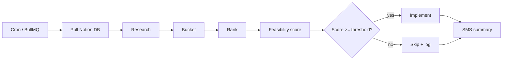

# PRD — Phase 6: Learning & Implementation

**Status:** 🚧 In progress  
**Owner:** Khalid  
**Dependencies:** Phases 0–5 complete; Notion workspace with a learning backlog database  

---

## Problem Statement

Product and engineering improvements are scattered across Notion, chat, and ad-hoc notes. Without a closed loop, research never becomes ranked work, and feasible wins never ship. Phase 6 introduces an autonomous **learn → bucket → rank → assess feasibility → implement → notify** pipeline that runs on a schedule with minimal manual intervention.

---

## Goals

- Pull backlog and learning items from Notion on a cron schedule.
- Run structured **research** before any implementation (codebase signals + Notion context).
- Place every researched item into a **bucket**, then **rank** and score **feasibility** — implementation only proceeds for items above the feasibility gate.
- Apply bounded, safe auto-implementation (Notion updates, learning docs, audit trail).
- Send Khalid a **text (SMS)** summary of what was researched, ranked, implemented, and skipped.

---

## Non-Goals (Phase 6)

- Unsupervised merges to `main` or production deploys.
- PHI-bearing research or implementation.
- Replacing human product judgment for large features (feasibility gate blocks these).

---

## Pipeline

| Stage | Output |
|-------|--------|
| **Pull** | Candidate rows from Notion (`Ready for research`, `Backlog`, or configured statuses) |
| **Research** | `researchNotes`: keywords, codebase hits, block summary |
| **Bucket** | `product` \| `engineering` \| `ops` \| `growth` \| `compliance` |
| **Rank** | `rankScore` = weighted impact × urgency ÷ effort |
| **Feasibility** | `feasibilityScore` 0–100; gate default **65** |
| **Implement** | Notion status update, optional `docs/learning-autogen/*.md`, `LearningCandidate` + `AuditLog` |
| **Notify** | SMS to `ALERT_SMS_TO` via Twilio |

---

## Environment

| Variable | Purpose |
|----------|---------|
| `LEARNING_LOOP_ENABLED` | `1` / `true` to run cycles |
| `NOTION_API_KEY` | Notion integration secret |
| `NOTION_LEARNING_DATABASE_ID` | Backlog database ID |
| `LEARNING_CRON` | Cron expression (default `0 6 * * *` — daily 06:00 server time) |
| `LEARNING_FEASIBILITY_MIN` | Minimum score to implement (default `65`) |
| `LEARNING_MAX_IMPLEMENT_PER_CYCLE` | Cap per run (default `3`) |
| `LEARNING_NOTION_STATUS_RESEARCH` | Comma-separated Notion statuses to pull |
| `ALERT_SMS_TO` | SMS recipients (shared with ops alerts) |

---

## Success Metrics

| Metric | Target |
|--------|--------|
| Cron reliability | ≥ 99% successful cycles when enabled |
| Research coverage | 100% of pulled items receive research notes before rank |
| Feasibility gate | 0 implementations below threshold in production |
| Founder visibility | SMS within 5 minutes of cycle completion |
| Auditability | Every cycle persisted in `learning_cycle_runs` |

---

## Implementation reference

- Engine: `Collect-RX-main/src/server/learning/`
- Scheduler: BullMQ `LEARNING_CYCLE` when `REDIS_URL` set; else in-process `node-cron`
- Ops: `docs/operations/PHASE6-LEARNING-LOOP.md`

---

## Related phases

| Phase | Topic |
|-------|--------|
| Phase 7 | [Pilot go-live & assumption validation](./phase-7-pilot-go-live.md) (formerly Phase 6) |
