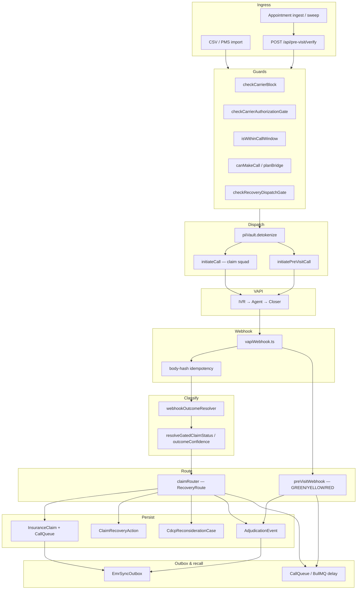

# CollectRx — Call-to-Resolution Architecture

**Status:** Living document (engineering review)  
**Last updated:** 2026-06-26  
**Audience:** Engineers, technical reviewers, investors with engineering depth  
**Scope:** How carrier voice calls enter the system, get dispatched, produce outcomes, and reach terminal resolution — post-visit claim recovery and pre-visit verification.

Related: [PHI / Vapi boundary](../compliance/PHI-VAPI-BOUNDARY.md) · [Engineering constitution](../CONSTITUTION.md)

---

## 1. What this system is

CollectRx is a **carrier-call execution engine** for Canadian dental practices. It does not replace the PMS (AbelDent, Dentrix, etc.) as the system of record. It sits beside it and:

1. **Post-visit:** dials insurance carrier provider lines to chase outstanding claims, classifies outcomes, and routes each claim to the correct next action (recall, wait for PMS sync, practice gate, CDCP reconsideration, or stop).
2. **Pre-visit:** checks eligibility and CDCP predetermination status before appointments, surfacing GREEN / YELLOW / RED signals so problems are visible before the patient is in the chair.

Both pipelines share the same **voice spine** (VAPI dispatch → webhook → structured outcome → persistence → EMR outbox). They differ in **ingress triggers** and **terminal state models**.

---

## 2. Shared spine

Every automated carrier interaction follows this pipeline:

```
INGRESS → GUARDS → DISPATCH → VAPI → WEBHOOK → CLASSIFY → ROUTE → PERSIST → OUTBOX → RECALL
```

| Stage | Responsibility |
|-------|----------------|
| **Ingress** | Claims (CSV/PMS import), appointments (ingest API / hourly sweep), manual verify API |
| **Guards** | Carrier block, authorization (BAAL), call window, plan/minutes, recovery route, practice gates |
| **Dispatch** | Detokenize PHI → build call payload → `initiateCall` / `initiatePreVisitCall` → create `CallAttempt` or update `AppointmentVerification` |
| **VAPI** | Squad navigates IVR, speaks to rep; PHI in ephemeral `variables` only (see §8) |
| **Webhook** | `POST /api/webhooks/vapi` — signature check, body-hash idempotency, route by metadata |
| **Classify** | Structured payload preferred; transcript regex fallback; financial corroboration gate |
| **Route** | Post-visit: `routeClaimRecovery` → `RecoveryRoute`. Pre-visit: traffic-light on `AppointmentVerification` |
| **Persist** | Claims, queue, recovery actions, CDCP cases, adjudication events |
| **Outbox** | `EmrSyncOutbox` — shadow ledger for PMS writeback |
| **Recall** | `CallQueue.scheduledFor` or BullMQ delayed jobs — loop until terminal |



---

## 3. Pipeline A — Post-visit claim recovery

### 3.1 Ingress

| Source | Path | Creates |
|--------|------|---------|
| PMS / CSV export | `POST /api/admin/sync` · `src/server/pms/pmsImportPipeline.ts` | `InsuranceClaim` rows |
| Manual / seed | `scripts/seed-demo.ts` · Prisma seed | Demo claims across all statuses |

Claims land with `status: PENDING` or `IN_QUEUE`, a `patientToken` (UUID), carrier, amounts, and aging metadata. PHI is tokenized at import; only the UUID is stored in Postgres.

### 3.2 Queue and dispatch

The **desk queue engine** (`src/server/frontDesk/queueEngine.ts`) ticks every 60 seconds per practice:

1. Skip if outside carrier call window (`isWithinCallWindow`).
2. Skip if practice queue paused (`PracticeDeskState.queuePaused`).
3. Skip if any call is `IN_PROGRESS` (**one simultaneous call per practice**).
4. Pick next eligible `CallQueue` row (`PENDING`, `scheduledFor <= now`).
5. Run **`validateDispatch()`** — claim age (≥30 days), max attempts, carrier-specific rules.
6. Run **`checkRecoveryDispatchGate()`** — block if route is terminal or blocking gate uncleared.
7. Run **`canMakeCall()`** — billing tier / minutes.
8. **`piiVault.detokenize(patientToken)`** → ephemeral PHI.
9. **`initiateCall()`** (`src/vapi/client.ts`) → VAPI squad.
10. Create **`CallAttempt`** linked to claim; set queue `IN_PROGRESS`.

Manual dispatch also exists via `src/routes/insurance.ts` for operator-triggered calls.

### 3.3 Webhook processing

Entry: `src/server/vapi/vapiWebhook.ts` → `processCallEnded()`.

**Branching:** If `metadata.appointmentVerificationId` is set → pre-visit handler (§4). Otherwise → claim recovery path.

Claim recovery path:

1. Load `CallAttempt` by `vapiCallId` (idempotent — skip if `ROUTE_ASSIGNED` event already exists for this attempt).
2. Scrub transcript PHI (`scrubTranscriptPhi`).
3. **`resolveOutcomeFromWebhookPayload()`** — `CallOutcome` + detail text.
4. **`extractStructuredClaimStatus()`** — prefer `analysis.collectrx` / structured fields.
5. **`resolveGatedClaimStatus()`** — downgrade financial terminals without corroboration (ref number or structured payload).
6. **`applyRecoveryAfterCall()`** (`src/server/recovery/recoveryLoopService.ts`).

### 3.4 The recovery router

**Single decision surface:** `routeClaimRecovery()` in `src/server/recovery/claimRouter.ts`.

Published decision table (abbreviated):

| When | `RecoveryRoute` | Claim status | Queue | Next action |
|------|-----------------|--------------|-------|-------------|
| Carrier block detected | `STOP` | `BLOCKED` | `BLOCKED` | None — carrier protocol |
| Paid / resolved + corroborated | `WAIT_SYNC` | `RESOLVED` | `COMPLETED` | `PAYMENT_VERIFY_SYNC` — wait for PMS balance drop |
| Approved, payment pending | `WAIT_SYNC` | `APPROVED_PENDING_PAYMENT` | `COMPLETED` | 14-day payment trace recall |
| Denied + CDCP (Sun Life) | `OPEN_CDCP` | `ESCALATED` | `ESCALATED` | `CDCP_RECONSIDERATION` + open case |
| Denied (private carrier) | `STOP` | `DENIED` | `COMPLETED` | Terminal |
| Resubmit / docs required | `PRACTICE_GATE` | `ON_HOLD` | `ESCALATED` | `PRACTICE_RESUBMIT` or `PRACTICE_DOCS` (**BLOCKING**) |
| Processing / no answer / failed | `CALL_CARRIER` | varies | `PENDING` | Scheduled recall (4h–14d) |

`applyRecoveryAfterCall()` atomically:

- Updates `InsuranceClaim.status`, `recoveryRoute`, `paymentExpectedBy`
- Upserts `CallQueue` (status, `scheduledFor`, attempt count)
- Creates / supersedes `ClaimRecoveryAction` (see `gateSupersession.ts`)
- Opens `CdcpReconsiderationCase` when `openCdcpCase` and carrier is `sun_life`
- Writes `ClaimRecoveryEvent` (`ROUTE_ASSIGNED`, payment events, etc.)
- Enqueues `EmrSyncOutbox` claim event

### 3.5 Dispatch gate (router vs dial permission)

The router decides **what should happen**. `checkRecoveryDispatchGate()` decides **whether a dial is allowed now**:

- Blocks when `recoveryRoute` ∈ `{ STOP, WAIT_SYNC, OPEN_CDCP, PRACTICE_GATE }`
- Blocks when a `ClaimRecoveryAction` with `status: BLOCKING` is uncleared
- Blocks when `CallQueue.scheduledFor` is in the future

This separation prevents the queue engine from calling carriers when the recovery loop has already moved the claim to a non-dial state.

### 3.6 Terminal resolution paths

| Terminal | How it is reached | What stops further calls |
|----------|-------------------|--------------------------|
| **RESOLVED** | Corroborated paid + PMS sync confirms `$0` outstanding | `recoveryRoute: STOP` after sync verification |
| **DENIED** | Private carrier final denial or coverage maxed | `recoveryRoute: STOP` |
| **BLOCKED** | Carrier block phrase detected | All claims to that carrier blocked |
| **OPEN_CDCP** | CDCP denial on Sun Life path | Generic carrier dials stop; reconsideration workflow owns the case |
| **ON_HOLD** | Practice gate (docs / resubmit) | Dispatch blocked until gate cleared |

Payment confirmation without a new call: `POST /api/insurance/claims/:id/confirm-payment` → `transitionClaimRecovery.ts` → `RESOLVED` + `STOP`.

### 3.7 Key files — post-visit

| Concern | File |
|---------|------|
| Queue tick / dispatch | `src/server/frontDesk/queueEngine.ts` |
| VAPI claim call | `src/vapi/client.ts` → `initiateCall()` |
| Webhook | `src/server/vapi/vapiWebhook.ts` |
| Outcome classification | `src/outcome/webhookOutcomeResolver.ts` |
| Financial gate | `src/server/claimStatusFromCallOutcome.ts` · `src/server/outcomeConfidence.ts` |
| Router | `src/server/recovery/claimRouter.ts` |
| Apply decision | `src/server/recovery/recoveryLoopService.ts` |
| Dispatch gate | `src/server/recovery/dispatchGate.ts` |
| Gate supersession | `src/server/recovery/gateSupersession.ts` |
| CDCP bridge from claims | `src/server/recovery/cdcpRecoveryBridge.ts` |
| Route explanation API | `src/server/recovery/routeExplainer.ts` |
| Carrier configs | `carriers/*.json` · `src/carriers/adapter.ts` |

---

## 4. Pipeline B — Pre-visit verification

### 4.1 Ingress

| Source | Path | Creates |
|--------|------|---------|
| Manual verify | `POST /api/pre-visit/verify` | `AppointmentVerification` |
| Batch ingest | `POST /api/pre-visit/appointments/ingest` | `ScheduledAppointment` → triggers verify |
| Hourly sweep | `APPOINTMENT_VERIFICATION_SWEEP` job in `rulesEngine.ts` | Appointments within 48h window |
| CDCP predet CSV | `POST /api/pre-visit/cdcp-predets/import` | `CdcpReconsiderationCase` (deadline tracker) |

### 4.2 Verification logic (before any call)

`verifyBeforeAppointment()` in `src/server/preVisit/appointmentVerification.ts`:

1. Create `AppointmentVerification` row (starts `GREEN`, finalized on exit).
2. **Guards:** `checkCarrierBlock`, `checkCarrierAuthorizationGate`, `isWithinCallWindow`.
3. **CDCP predet rules:** `predetSubmissionRules.ts` — required artifacts per procedure; missing docs → `RED` / `YELLOW`.
4. **Existing CDCP case lookup:** match by `procedureCode` variants (not “most recent denial”) → deadline warnings / `RED` if window expired.
5. **Eligibility snapshot staleness:** snapshot older than 30 days → enqueue eligibility job.
6. **Electronic paths first:** `tryCanadaLifePortalPreVisit()`, `tryTelusTx23PreVisit()` — skip voice if resolved.
7. **Voice fallback:** enqueue BullMQ job with delay until next call window if needed.

**Important:** Pre-visit does **not** use `validateDispatch()` (claim-age rules). It uses the pre-visit guard set above.

### 4.3 Dispatch

Worker: `src/server/workerEntry.ts` handles `PRE_VISIT_ELIGIBILITY` and `PRE_VISIT_CDCP_PREDET`.

`dispatchPreVisitCall()` (`src/server/preVisit/preVisitDispatch.ts`):

- Max 3 attempts per verification
- Same block / auth / plan gates as post-visit
- Detokenize → **`initiatePreVisitCall()`** with `preVisitType: eligibility | cdcp_predet`
- Increments `AppointmentVerification.attemptCount`
- Writes `AdjudicationEvent` on dispatch

Queue: shared BullMQ queue `collectrx-ar` (`src/server/jobs/arQueue.ts`). Job dedup key: `pre-visit:{type}:{practiceId}:{patientToken}:{carrierId}`.

### 4.4 Webhook processing

`processPreVisitCallEnded()` in `src/server/preVisit/preVisitWebhook.ts`:

1. Load verification by `metadata.appointmentVerificationId`.
2. Read structured fields: `predetermination_status`, `eligibility_status`, denial codes.
3. Set `AppointmentVerification.status` → GREEN / YELLOW / RED + `reason`.
4. On CDCP denial signal → `upsertReconsiderationFromSignal()` → `CdcpReconsiderationCase`.
5. Write `EligibilitySnapshot` when eligibility call.
6. Write `AdjudicationEvent` + `EmrSyncOutbox` (`pre-visit:{verificationId}`).

### 4.5 Terminal states (traffic lights)

| Signal | Meaning | Typical `reason` |
|--------|---------|------------------|
| **GREEN** | Eligible; predet approved; docs complete | `cdcp_predet_approved` |
| **YELLOW** | Pending; call failed (retry); snapshot stale; reconsideration expiring | `cdcp_predet_pending`, `call_failed_retry` |
| **RED** | Denied; ineligible; window expired; blocked; error | `cdcp_predet_denied`, `cdcp_window_expired`, `verification_error` |

Pre-visit terminals do **not** mutate `InsuranceClaim` — there may be no claim yet.

### 4.6 Key files — pre-visit

| Concern | File |
|---------|------|
| Core verification | `src/server/preVisit/appointmentVerification.ts` |
| Predet doc rules | `src/server/preVisit/predetSubmissionRules.ts` |
| CDCP procedure rules | `src/server/preVisit/procedureRules.ts` |
| Electronic (portal / Tx23) | `src/server/preVisit/electronicPreVisit.ts` |
| Jobs | `src/server/preVisit/preVisitJobs.ts` |
| Worker dispatch | `src/server/preVisit/preVisitDispatch.ts` |
| Webhook | `src/server/preVisit/preVisitWebhook.ts` |
| Appointment ingest | `src/server/preVisit/appointmentIngest.ts` |
| CDCP CSV import | `src/server/preVisit/importCdcpPredetCases.ts` |
| API routes | `src/server/routes/preVisitRoutes.ts` |
| UI | `src/pages/PreVisitCommandCenter.tsx` |
| VAPI pre-visit call | `src/vapi/client.ts` → `initiatePreVisitCall()` |

---

## 5. CDCP bridge — connecting both pipelines

CDCP (Canadian Dental Care Plan) is administered via Sun Life. CollectRx treats `carrierId: sun_life` as the CDCP path when context flags or denial signals indicate CDCP.

### 5.1 Shared case store

**Model:** `CdcpReconsiderationCase` (`prisma/schema.prisma`)

| Field | Purpose |
|-------|---------|
| `claimRef` | Predet ref or claim number (idempotency key with `practiceId`) |
| `procedureCode` | CDT code for matching pre-visit appointments |
| `denialDate` | Start of 60-day reconsideration window |
| `status` | `open`, `submitted`, `approved`, `denied_final`, `excluded` |

**Enrichment:** `enrichCase()` in `src/server/canadianExpansion/reconsideration.ts` adds `daysRemaining`, `windowExpired`.

### 5.2 How cases are created

| Path | Trigger |
|------|---------|
| Post-visit call | Router sets `openCdcpCase` → `ensureCdcpCaseForClaim()` |
| Pre-visit webhook | `detectDenialFromEndOfCall()` → `upsertReconsiderationFromSignal()` |
| PMS T11 denial ingest | `POST /api/cdcp/denied-claims` |
| CSV import | `POST /api/pre-visit/cdcp-predets/import` |
| Auto from Vapi end-of-call (legacy) | `maybeAutoCreateFromVapiBody()` |

### 5.3 Intended lifecycle (full product arc)

```
Pre-visit: predet denied → CdcpReconsiderationCase opened → deadline tracked
    ↓
Treatment occurs (out of scope for CollectRx)
    ↓
Post-visit: claim submitted → if denied again → OPEN_CDCP route → same or linked case
    ↓
Reconsideration submitted → approved → RESOLVED via WAIT_SYNC
```

**Current engineering gap:** Pre-visit predet refs and post-visit claim numbers are not automatically linked into one case chain. Matching today is by `(practiceId, patientToken, procedureCode)` and manual `claimRef`. See §9.

---

## 6. Shadow ledger and adjudication graph

### 6.1 EMR sync outbox

**Model:** `EmrSyncOutbox`

Every terminal or significant transition enqueues an outbound event for the practice PMS connector:

- Claim events: `enqueueEmrClaimEvent()` — claim ID in outbox row
- Pre-visit events: `enqueueEmrPreVisitEvent()` — synthetic claim ID `pre-visit:{verificationId}`

Worker drains rows where `processedAt IS NULL` (`src/server/emrSyncOutbox.ts`).

### 6.2 Adjudication events

**Model:** `AdjudicationEvent`

Append-only log of carrier interactions:

- `callType`: `pre_visit_eligibility`, `pre_visit_cdcp`, post-visit types
- Structured fields: eligibility status, predet status, denial codes, docs present, call duration
- Links: `appointmentVerificationId`, `claimId`, `cdcpCaseId`, `vapiCallId`

**Write path:** complete (`writeAdjudicationEvent.ts` — never throws).  
**Read path:** API exists (`GET /api/pre-visit/adjudication-events`); prediction / graph UI not built.

---

## 7. Data model map

```
Practice
  ├── InsuranceClaim ── CallAttempt ── (VAPI call)
  │       ├── CallQueue
  │       ├── ClaimRecoveryAction
  │       ├── ClaimRecoveryEvent
  │       └── CdcpReconsiderationCase? (via claimRef)
  │
  ├── AppointmentVerification ── (VAPI pre-visit call)
  │       └── ScheduledAppointment?
  │
  ├── CdcpReconsiderationCase (standalone / linked)
  ├── AdjudicationEvent (cross-cutting)
  ├── EmrSyncOutbox (cross-cutting)
  └── EligibilitySnapshot
```

**PHI rule:** `patientToken` (UUID) in all of the above. Real name/DOB/policy only in `piiVault` and ephemeral VAPI variables.

---

## 8. PHI and VAPI boundary

Full decision record: [PHI-VAPI-BOUNDARY.md](../compliance/PHI-VAPI-BOUNDARY.md).

Summary:

```
CSV import → piiVault.tokenize(PHI) → UUID in DB
Dispatch   → piiVault.detokenize(token) → PHI in memory only
VAPI call  → PHI in variables (ephemeral); metadata = UUIDs only
Call ends  → transcript scrubbed; recording deleted
Persist    → outcomes, routes, amounts — never raw PHI in Postgres
```

---

## 9. Known engineering gaps (review targets)

These are **documented seams**, not blockers for understanding the architecture.

| Gap | Impact | Likely fix | Status |
|-----|--------|------------|--------|
| Pre-visit uses claim-recovery VAPI squad | Structured outputs may not match predet/eligibility prompts | Dedicated pre-visit assistant + output schema | Done — `vapi-previsit-config.json` + Zod parser |
| `Phase5Dashboard` (`/cdcp`) falls back to mock | Two CDCP UIs, one stale | Point at same APIs as `/pre-visit` or redirect | Done — `/cdcp` → `/pre-visit?tab=kpis` |
| Portal / Tx23 adapters are stubs | “Electronic first” is architectural, not always operational | Real `PROVIDER_CONNECT_*` / CDAnet adapters | Done — portal HTTP + `cdanetTx23Client.ts` |
| No case spine predet → claim | Pre and post pipelines don't share one case ID | Link table or `claimRef` aliasing on `CdcpReconsiderationCase` | `linkedClaimRefs` metadata + procedure match |
| Adjudication graph read-only in product | Graph foundation exists; no prediction UI | Read API + dashboard slice | Done |
| Legacy patient-layer tables on Railway | Schema drift vs Prisma (Patient, Balance) | Run or defer migration | Done — `npm run db:apply-schema-drift` |
| Pre-visit VAPI assistant config | Same squad ID env var | `VAPI_PREVISIT_ASSISTANT_ID` or separate squad | Done — `VAPI_PREVISIT_SQUAD_ID` |
| Pre-visit webhook not routed in production | `vapiDeskEvents` required `claimId` | Branch on `appointmentVerificationId` | Done |
| Pre-visit no recall on failed call | `call_failed_retry` did not re-enqueue | BullMQ delayed job | Done — 4h recall |

---

## 10. Validation matrix (engineering)

What is proven in code/tests vs assumed for production carrier behavior.

| Capability | Evidence | Level |
|------------|----------|-------|
| Webhook idempotency | `tests/recovery.integration.test.ts` | **Proven** |
| Recovery router decisions | Unit tests + `CLAIM_ROUTER_DECISION_TABLE` | **Proven** |
| Gate supersession | `tests/phase-5/gate-supersession.test.ts` | **Proven** |
| Pre-visit verification logic | `appointmentVerification.test.ts` | **Proven** |
| Pre-visit webhook pipeline | `preVisitWebhook.test.ts` + integration test | **Proven** |
| CDCP CSV import | `preVisit.integration.test.ts` | **Proven** |
| Full suite | 827 tests (`npm test`) | **Proven** |
| Live VAPI IVR navigation | Requires kill test + BAAL | **Assumed** |
| Portal / Tx23 resolution | `cdanetTx23Client.ts` + `providerConnect-adapter.ts` | **Partial** (gateway HTTP; live carrier behavior assumed) |
| Adjudication graph UI | `adjudicationGraph.ts` + PreVisit tab | **Proven** |
| PMS writeback delivery | Outbox enqueued; connector varies | **Partial** |

---

## 11. Operations reference

See [PHASE6-OPS.md](../../../docs/operations/PHASE6-OPS.md) for health checks, deploy, and smoke curls.

---

## 12. Practice UI map (owner vs coordinator)

How each surface behaves by role. Routes stay stable; sidebar groups **After visit** (Claims) vs **Before visit** (Pre-visit).

| Surface | Route | Owner | Office mgr / coordinator | Front desk | Status |
|---------|-------|-------|--------------------------|------------|--------|
| Command center | `/dashboard` | Read-only loop + Needs you | Full | Blocked | **Implemented** |
| Live activity strip | Dashboard | View claim link | View | N/A | **Implemented** |
| Top money at risk | Dashboard | Top 5 ranked claims | Same | N/A | **Implemented** |
| Claims hub | `/insurance` | All tabs read-only; no Call btn | Call + gates | List only | **Implemented** |
| Priority queue tab | `/insurance?tab=queue` | Rank + $ at risk | Sync + rep notes | N/A | **Implemented** |
| Blocked gates tab | `/insurance?tab=blocked` | View + clear (if permitted) | Clear gates | N/A | **Implemented** |
| Needs human tab | `/insurance?tab=human` | View escalations | Resolve | Escalations page | **Implemented** |
| Claim detail timeline | `/insurance/:id` | What's next + history | + Trigger call | N/A | **Implemented** |
| Simulated call badge | Claim detail / live strip | When `vapiCallId` starts with `demo-` | Same | Same | **Implemented** |
| Pre-visit command center | `/pre-visit` | View signals | View + import | N/A | **Implemented** |
| Live console | `/console` | Blocked | Blocked | Pause / takeover | **Implemented** |
| Carrier intel | `/reports/carriers` | Drill-down from Claims | Full report | N/A | **Implemented** |
| Legacy work queue | `/work-queue` | Redirects → Claims queue tab | Redirect | N/A | **Redirect** |
| Legacy gate inbox | `/insurance/gates` | Redirects → blocked tab | Redirect | N/A | **Redirect** |

**Demo narrative:** `npm run demo:seed` — see [claims-ux-roadmap.md](../product/claims-ux-roadmap.md) and `OfficeGuide.tsx` for the four story claim refs.

