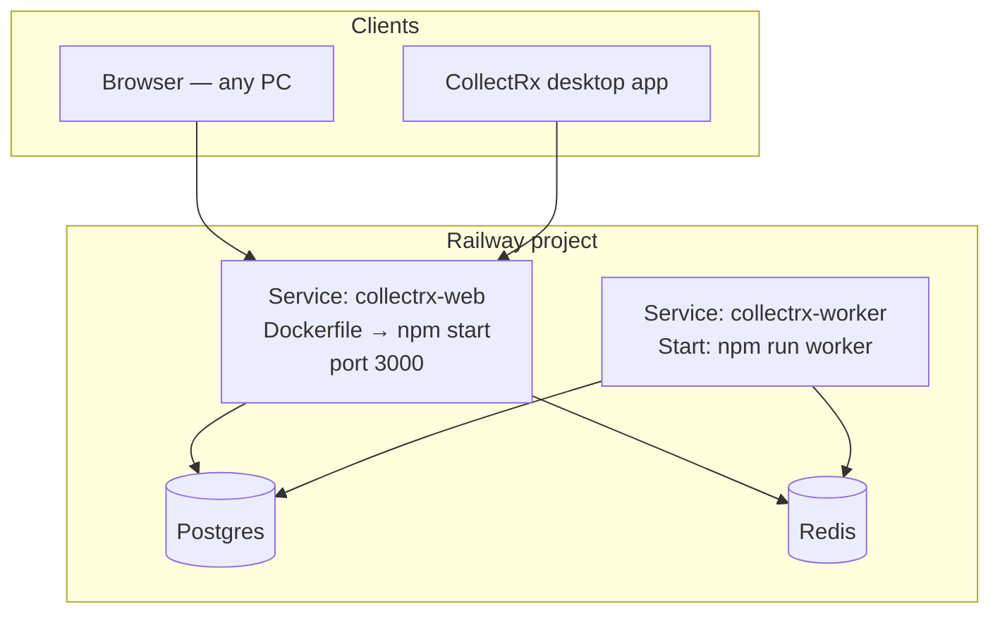

# Railway production — CollectRx for clients (not your Mac)

CollectRx is meant to run **24/7 on Railway** so dental practices can use it from any computer. Your laptop is only for development and deploys — clients never run `npm start`.

## Architecture (what you deploy)



| Service | Purpose | Start command |
|---------|---------|---------------|
| **collectrx-web** | API + React UI (single URL for everyone) | Default from Dockerfile: `npm start` |
| **Postgres** | All practice data | Railway plugin |
| **Redis** | Job queue (reminders, rules, learning loop) | Railway plugin |
| **collectrx-worker** | Background jobs 24/7 | **`npm run worker`** (override in Railway) |

**Minimum to sell:** web + Postgres.  
**Recommended for production:** web + Postgres + Redis + worker (reminders and Phase 6 learning won’t depend on your Mac).

---

## Step 1 — Railway project

1. [railway.app](https://railway.app) → **New project**
2. **Add PostgreSQL** (one click)
3. **Deploy from GitHub** → your `collectrx-platform` repo

### Root directory (monorepo)

**collectrx-web** → **Settings → Source → Root Directory:**

```text
Collect-RX-main
```

Railway must build from `Collect-RX-main/Dockerfile` (already configured in `railway.toml`).

---

## Step 2 — Web service variables

**collectrx-web** → **Variables**. Use **Reference** for `DATABASE_URL` from Postgres.

### Required (app boots + login works)

| Variable | Value |
|----------|--------|
| `DATABASE_URL` | Reference → Postgres |
| `NODE_ENV` | `production` |
| `JWT_SECRET` | `openssl rand -hex 32` |
| `PUBLIC_APP_URL` | `https://YOUR_DOMAIN` (Railway domain or `https://www.collectrx.ca`) |
| `ALLOWED_ORIGINS` | Same URL, no trailing slash |
| `SERVER_URL` | Same as `PUBLIC_APP_URL` |
| `VAPI_WEBHOOK_SECRET` | `openssl rand -hex 32` (must match Vapi dashboard) |
| `SENDGRID_EVENT_WEBHOOK_VERIFICATION_KEY` | From SendGrid Event Webhook setup |

After first deploy, set the three URL variables to your **public** HTTPS URL (generated Railway domain or custom domain).

### Integrations (enable as you sell features)

| Variable | When |
|----------|------|
| `VAPI_API_KEY`, `VAPI_PHONE_NUMBER_ID` | AI carrier calls |
| `SENDGRID_API_KEY`, `SENDGRID_FROM_EMAIL` | Email reminders |
| `TWILIO_*`, `ALERT_SMS_TO` | SMS + ops alerts |
| `STRIPE_SECRET_KEY`, `STRIPE_WEBHOOK_SECRET` | Patient pay + practice billing |
| `STRIPE_PRACTICE_SUBSCRIPTION_PRICE_ID` | SaaS subscription per practice |
| `SUBSCRIPTION_ENFORCE` | `true` when billing is live |

Practice-facing copy (reminders):

```bash
PRACTICE_NAME=...
PRACTICE_PHONE=...
PRACTICE_EMAIL=...
```

### Phase 6 — learning loop (runs on Railway, not your Mac)

| Variable | Value |
|----------|--------|
| `LEARNING_LOOP_ENABLED` | `1` |
| `NOTION_API_KEY` | Notion integration secret |
| `NOTION_LEARNING_DATABASE_ID` | Backlog database ID |
| `LEARNING_CRON` | `0 6 * * *` (daily 6:00 UTC — adjust as needed) |
| `LEARNING_FEASIBILITY_MIN` | `65` |
| `LEARNING_MAX_IMPLEMENT_PER_CYCLE` | `3` |

SMS summaries use the same Twilio vars as `ALERT_SMS_TO`.

---

## Step 3 — Migrations (automatic)

`Collect-RX-main/railway.toml` already includes:

```toml
releaseCommand = "npx prisma migrate deploy"
```

Each deploy runs migrations before traffic shifts. No manual `npm run db:migrate` on your Mac for routine releases.

**First deploy:** if `/api/health/ready` fails, open deploy logs for Prisma errors, or run once:

```bash
railway run npx prisma migrate deploy
```

(from linked project, service `collectrx-web`, root `Collect-RX-main`)

---

## Step 4 — Redis + worker (recommended)

### Add Redis

1. Project → **New** → **Database** → **Redis**
2. On **collectrx-web** → Variables → **Add reference** → `REDIS_URL` from Redis

### Add worker service

1. **New** → **GitHub Repo** → same repo
2. **Root Directory:** `Collect-RX-main`
3. **Settings → Deploy → Custom Start Command:**

   ```bash
   npm run worker
   ```

4. **Same Dockerfile** as web (default — do not change builder)
5. **Variables:** copy from web at minimum:
   - `DATABASE_URL` (reference Postgres)
   - `REDIS_URL` (reference Redis)
   - `NODE_ENV=production`
   - Same integration vars the worker needs (Twilio, SendGrid, etc. as you enable them)
   - Phase 6: `LEARNING_LOOP_ENABLED`, Notion vars

6. **No public domain** on the worker — it does not serve HTTP.

Worker processes:

- `RULES_TICK` — insurance queue / EMR outbox
- `REMINDER_CYCLE` — patient AR reminders
- `LEARNING_CYCLE` — Notion research → rank → implement → SMS

---

## Step 5 — Custom domain (for selling)

1. **collectrx-web** → **Settings → Networking** → add `www.collectrx.ca` (or your domain)
2. DNS at your registrar → CNAME to Railway’s target
3. Update `PUBLIC_APP_URL`, `ALLOWED_ORIGINS`, `SERVER_URL` to `https://www.collectrx.ca`
4. Redeploy

Clients and the desktop app should only ever see this HTTPS URL.

---

## Step 6 — Desktop app for practices

Practices install CollectRx for Windows/Mac; the app loads your **hosted** URL, not localhost.

On each practice machine (or baked into installer docs):

```text
https://www.collectrx.ca
```

Mac config file (one line):

```bash
~/Library/Application Support/dental-ar-system/dashboard-url.txt
```

Windows: equivalent path in `%APPDATA%` per your installer docs.

**You** set this once per release to your Railway/custom domain — not per developer session.

---

## Step 7 — Verify production

| Check | URL / action |
|-------|----------------|
| Liveness | `GET https://YOUR_DOMAIN/api/health` |
| DB ready | `GET https://YOUR_DOMAIN/api/health/ready` → 200 |
| UI | `https://YOUR_DOMAIN/login` |
| Queue (if Redis) | `GET https://YOUR_DOMAIN/api/health/queue` |
| Env checklist | Locally: `NODE_ENV=production node scripts/check-deploy-env.mjs` with Railway vars exported |

---

## What clients never do

| They do **not** | You do on Railway |
|-----------------|-------------------|
| `npm start` / `npm run dev` | Web service always running |
| Run Postgres locally | Managed Postgres |
| Run learning cron manually | Worker + `LEARNING_LOOP_ENABLED` |
| Keep your Mac online | Nothing — deploy and monitor Railway |

---

## Deploy workflow (ongoing)

1. Push to `main` (or your release branch)
2. Railway builds Docker image → runs `prisma migrate deploy` → starts web
3. Worker redeploys from same commit
4. Smoke: `/api/health`, login, one critical path

Local Mac: only for coding and `git push` — not for serving clients.

---

## Related docs

- [Collect-RX-main/DEPLOY.md](../../Collect-RX-main/DEPLOY.md) — step-by-step first deploy, webhooks, safety vars
- [PHASE8-BACKGROUND.md](./PHASE8-BACKGROUND.md) — queue behavior, scaling notes
- [PHASE6-LEARNING-LOOP.md](./PHASE6-LEARNING-LOOP.md) — Notion database shape
- [ALWAYS-ON.md](./ALWAYS-ON.md) — PM2 only if you still need local background (not for clients)
